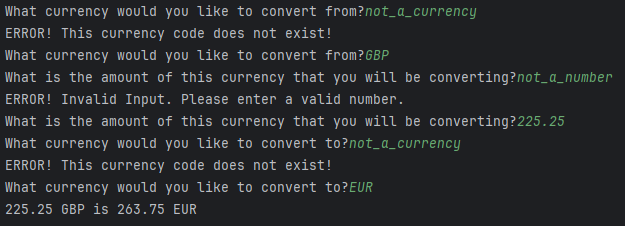

# Currency Converter Project

### Key Features
* Fetch Real Time exchange rates from a currency conversion API.
* Convert between different currencies.
* Handle invalid user input and display relevant error messages.

### How to use
* Go to https://app.freecurrencyapi.com and create an account
* Generate an API key and assign it to the api_string variable on line 7 as a string
  * `api_string = "this_is_your_api_string"`
* You can now use this currency converter.

### Version 0.1
- This version was developed to be CLI based.
- This version uses the freecurrencyapi API to retrieve live currency conversion rates.
- All inputs have input validation.
- Example Output:
 

### Version 0.2
- In progress.

### Plans for future features:
* Display a list of available currencies that can be used for conversions.
* Option to fetch exchange rates for multiple currencies.
* Create a user interface using the Tkinter library.
  * Create a display with all conversions from the users selected local currency. Similar to how a currency exchange booth looks in real life.
  * Create a menu to convert currencies in a manner similar to how Version 1.0 works.